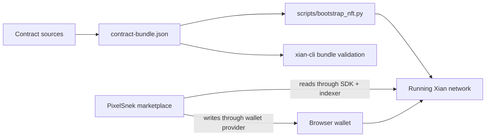

# xian-nft — PixelSnek NFT Product

`xian-nft` is the Xian NFT product repo. It owns the **XSC-0005** checker and
reference collection contracts, the PixelSnek marketplace, and bootstrap tooling
for installing the product after a Xian chain exists.

The marketplace is built with Vite + React 19 + TypeScript + Tailwind v4 +
[daisyUI](https://daisyui.com/) v5. NFTs are displayed using daisyUI's
[`hover-3d`](https://daisyui.com/components/hover-3d/) component for a tactile,
premium feel as users move their mouse over each card.

## Product Shape



## Quick Start

Frontend:

```bash
npm install
npm run dev      # http://localhost:5180
npm run build    # production bundle in dist/
```

Deploy the product contracts onto an existing chain:

```bash
uv run --project ../xian-cli xian contract bundle validate contract-bundle.json
uv run --group deploy python scripts/bootstrap_nft.py
```

## Features

- **Explore** — a curated home page with hot listings, featured collections, and live marketplace activity.
- **Collections** — browse every registered XSC-0005 collection with search.
- **Collection detail** — banner, on-chain metadata, NFT grid with filters/sort/search.
- **Token detail** — large hover-3d card, on-chain content inspector, full action surface:
  - Buy (approve + buy in a single flow)
  - List for sale (any payment-token contract, optional reservation)
  - Cancel listing, transfer, burn, like, prove ownership
- **Create** — mint into any collection you operate; upload SVG/PNG/JPEG/GIF/JSON/text;
  set royalty (bps) and royalty receiver.
- **Pixel-grid mint** — first-class support for the XSC-0005 PixelGrid extension:
  build a palette (≤ 64 colors, locked-on-create), paint cells in an in-browser
  editor, optionally chain multiple frames into an animation, and submit via
  `mint_pixel_grid`. Pixel-grid tokens then render natively via a `<canvas>` that
  decodes the on-chain `palette-index-64` data against the on-chain palette.
- **Register** — add any XSC-0005 collection by contract address (verified on-chain
  through `con_xsc005.is_XSC005`).
- **Profile** — owned, listed, and created tabs for any address.
- **Activity** — global event feed (mint / sale / list / transfer / like / burn).
- **Operator tools** — collection operators can edit collection metadata and hand
  off the operator role from the collection page.
- **Approvals UI** — per-token `approve`/`revoke` and collection-wide
  `set_approval_for_all` from the token detail page.
- **Prove ownership** — owners can sign / attach a proof string from the token
  detail page (XSC-0005 `prove_ownership`).
- Indexer-down banner when the configured node doesn't expose the indexer
  endpoints PixelSnek depends on.
- Chunked-mint resumability: if a multi-tx mint dies partway, the next attempt
  picks up where it left off instead of duplicating chunks.
- Decimal-safe price pipeline: all listing prices flow through string-decimal
  helpers so chain precision is preserved end-to-end (no JS `Number` rounding).
- Auto-discovery of new XSC-0005 collections via the indexer's recent-events stream.
- Generative fallback SVGs for NFTs with no inline media.

## Stack

- **Build**: Vite 8 + TypeScript 5.6
- **UI**: React 19, Tailwind v4, daisyUI 5
- **Routing**: React Router v7
- **Icons**: lucide-react
- **Contracts**: XSC-0005 checker and reference collection in `contracts/`
- **Bootstrap**: `scripts/bootstrap_nft.py`
- **Blockchain**: `@xian-tech/client` (RPC), `@xian-tech/provider` injected wallet API
- **Indexer**: direct `/abci_query` calls for `listEvents` / `recent_events` (falls back gracefully if unavailable)

## Principles

- **One owning repo.** Contracts, marketplace, bundle, and bootstrap ship and
  version together as the NFT product surface.
- **Bundle as the canonical interface.** Downstream deployers consume the
  hash-pinned `contract-bundle.json`, not raw contract files.
- **Post-genesis install.** The product is installed onto an existing chain;
  it is not a genesis contract and is not shipped in node images.
- **Standard-first UI.** PixelSnek works against any XSC-0005 collection, not
  only the reference contract; collections are verified through
  `con_xsc005.is_XSC005` before registration.
- **Indexer optional.** All core flows work from raw state reads; indexed
  event feeds enhance the UI and degrade gracefully when unavailable.

## Contracts And Bootstrap

The product contract surface is:

- `contracts/con_xsc005.py` — XSC-0005 checker
- `contracts/con_xsc005_nft.py` — reference collection with minting, listing,
  buying, royalties, approvals, likes, ownership proofs, chunked content, and
  PixelGrid support
- `contract-bundle.json` — hash-pinned bundle for the product repo

Deploy onto an existing chain:

```bash
uv run --group deploy python scripts/bootstrap_nft.py
```

For operator automation, validate the repo-owned bundle and run the bootstrap
from this repo after the target network is healthy:

```bash
uv run --project ../xian-cli xian contract bundle validate contract-bundle.json
uv run --group deploy python scripts/bootstrap_nft.py
```

## Key Directories

- `contracts/` — XSC-0005 interface checker and reference NFT collection /
  marketplace contract.
- `scripts/` — `bootstrap_nft.py` post-genesis bootstrap, `mock-rpc.mjs` mock
  RPC for UI development, `verify-localnet.py` local VM contract verification.
- `src/components/` — reusable UI: Hover3DCard, NFTMedia, dialogs, Header, …
- `src/routes/` — one file per page (Home, Collections, CollectionDetail, …).
- `src/hooks/` — useWallet, useToasts, useCollection(s), useToken.
- `src/lib/` — service layer: RPC client (`xian.ts`), injected wallet wrapper
  (`wallet.ts`), full XSC-0005 surface (`nft.ts`), token discovery, collection
  registry, activity feed, media rendering, indexer helpers, formatting,
  hashing, URL normalization, and constants.
- `src/styles/` — Tailwind + daisyUI theme ("snek") and utilities.

## How NFTs Are Rendered

`Hover3DCard` wraps the daisyUI `hover-3d` component with the **8 empty `<div>` zones**
required by the library to detect mouse position and apply tilt. Each card holds a
`NFTMedia` that resolves the on-chain content into the right preview:

| MIME + encoding              | Renderer                                  |
| ---------------------------- | ----------------------------------------- |
| `image/svg+xml` + utf8       | data URL `` with `image-rendering: pixelated` |
| `image/*` + base64           | `data:<mime>;base64,…`                    |
| `image/*` + utf8 (URL)       | ``                         |
| `video/*` + base64           | `<video autoplay muted loop>`             |
| `audio/*` + base64           | `<audio controls>` over fallback artwork  |
| `application/json` + utf8    | Pretty-printed `<pre>` panel              |
| `text/*` + utf8              | Raw `<pre>`                               |
| No content + `uri`           | Falls back to the external URI            |
| No usable media              | Generative gradient SVG keyed on token id |

## XSC-0005 Contract Surface Used

PixelSnek talks to any XSC-0005 collection via:

- **State reads** (`/get/<contract>.<var>:<keys>`): `metadata`, `token_data`, `owners`,
  `balances`, `listings`, `approvals`, `operator_approvals`, `likes`, `content_chunks`,
  `token_count`.
- **Pure simulations** (`call`): `is_XSC005(contract)` on `con_xsc005`.
- **Writes** (via injected wallet): `mint`, `mint_chunked`, `set_content_chunk`,
  `lock_content`, `transfer`, `transfer_from`, `approve`, `revoke`,
  `set_approval_for_all`, `list_for_sale`, `cancel_listing`, `buy`, `burn`, `like`,
  `prove_ownership`, plus a currency-token `approve` step before `buy`.
- **Indexer events** (optional): `Transfer`, `TokenListed`, `TokenSale`, `TokenLiked`.

## Configuration

- The default RPC is `http://127.0.0.1:26657`. Override via `localStorage`:
  `localStorage.setItem("pixelsnek.rpc", "http://your-node:26657")`.
- Known seed collections live in `src/lib/constants.ts` (`KNOWN_COLLECTIONS`). Add more
  there or via the in-app "Register a collection" flow.

## Deploying A New Collection

Deploy a fresh XSC-0005 collection through `scripts/bootstrap_nft.py` or another
operator-controlled deployment pipeline using `contracts/con_xsc005_nft.py`.
Then register the new contract address in PixelSnek.

## Validation

```bash
npm run typecheck
npm test
npm run build

uv sync --group dev
uv run ruff check .
uv run ruff format --check .
```

## Related Docs

- [contract-bundle.json](contract-bundle.json) — canonical hash-pinned bundle for downstream deployers
- [`../xian-js/README.md`](../xian-js/README.md) — `@xian-tech/client` and `@xian-tech/provider` consumed by the marketplace
- [`../xian-xips/README.md`](../xian-xips/README.md) — XSC standards, including XSC-0005
- [`../xian-docs-web/README.md`](../xian-docs-web/README.md) — public docs, including the products section
